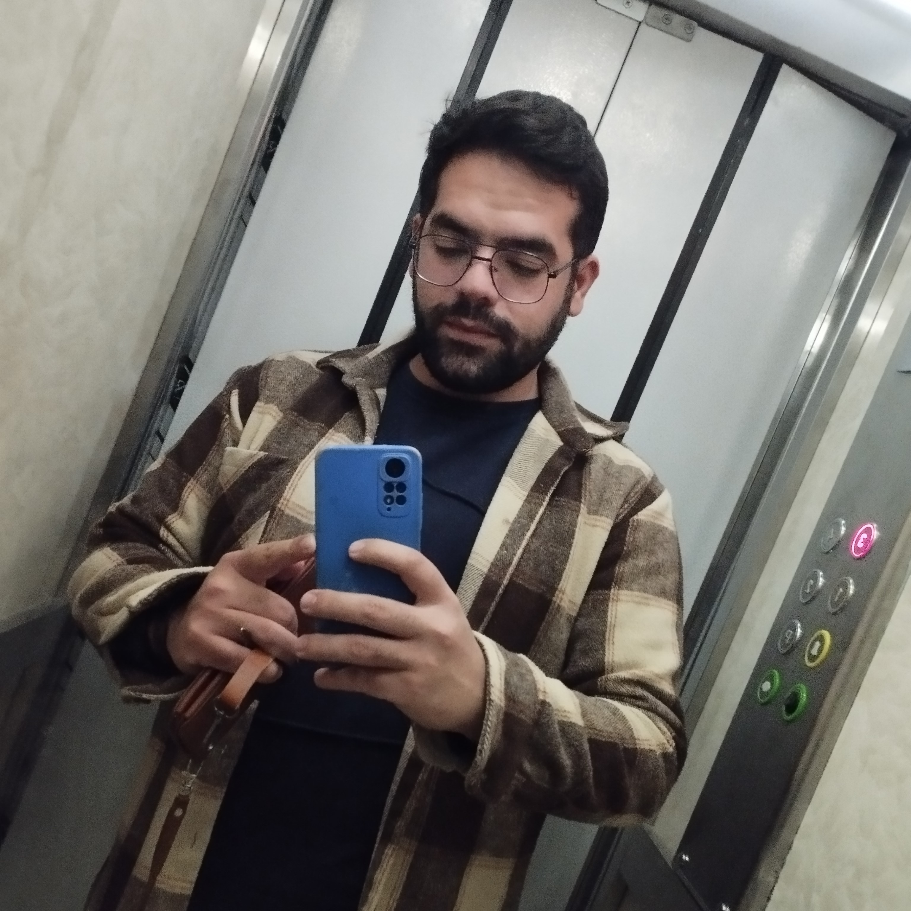

In the name of God of knowledge, love and courtesy.

Hi everyone :)

My name is Mohammad Rasul Azizi, senior expert in artificial intelligence, trainer and Teaching instructor of Python and C++ programming.

if you want to know me <a href='#bio-id'>Click Me!</a>

<h4 id='bio-id'> Let's get to know me more.</h4>

--- 
## Biography:
- Born in October 1998 in the beautiful city of Kermanshah.
- Graduated with a bachelor's degree in computer science from Razi University of Kermanshah as the first rank.
- Graduated with a master's degree in computer science, majoring in artificial intelligence, from Mazandaran University.
- Member of the Scientific Association of Computer Science Students of Razi University.
- Assistant Professor at Mazandaran University for two years.
- Instructor of introductory Python, advanced Python, data analysis, machine learning courses at Mazandaran University.
- Coach, consultant and content producer at Junior Academy for teenagers and young adults.
---
now you know a little more about me.

if you want to know about my professional  work I can say:

---
## Experience:
- **Razi University:**
    - ***Assistant professor of programming*** *for undergraduate students of computer science.*
- **Python course instructor** *, Kermanshah Hoosh Masnoei academy · (8 months, Part-time.)*
- **Mazandaran University:**
    - ***Professor of Python programming*** *for undergraduate students of computer science.*
    - **Professor of advanced programming** *for undergraduate mathematics students.*
- **Workshop:**
    - ***Instructor of the introductory Python*** *training workshop under the management of the Scientific and Mathematical Association of the students of the country. (2 months, Part-time.)*
    - ***Instructor of advanced Python*** *training workshop under the management of the Scientific and Mathematical Association of the students of the country. (2 months, Part-time.)*
    - ***Instructor of the introductory Data Analsys with python*** *training workshop under the management of the Scientific and Mathematical Association of the students of the country. (2 months, Part-time.)*
    - ***Instructor of the introductory Machine Learning with python*** *training workshop under the management of the Scientific and Mathematical Association of the students of the country. (2 months, Part-time.)*

- **Juniora Academy:**
    - *Teaching instructor for **programming and algorithmic thinking** courses.(Remote)*
    - *Programming professor **code camp course** for teenagers of Mazandaran.(1 month, Full-time, Hybrid)*
    - ***Produce educational content**. (Remote)*
    - ***Educational consultant in the field of programming**. (Remote)*
- ***Freelancer** in the fields of programming and artificial intelligence and machine learning.*
--- 

now if you want to know more about:

* [Linkdin Profile](https://www.linkedin.com/in/mohammad-rasoul-azizi-18a14320b)
* [Telegram](https://t.me/Mohammad_Rasoul_Azizi)

and that is my G-mail:

`Azizi.mr1377@mail.com`

with respect

